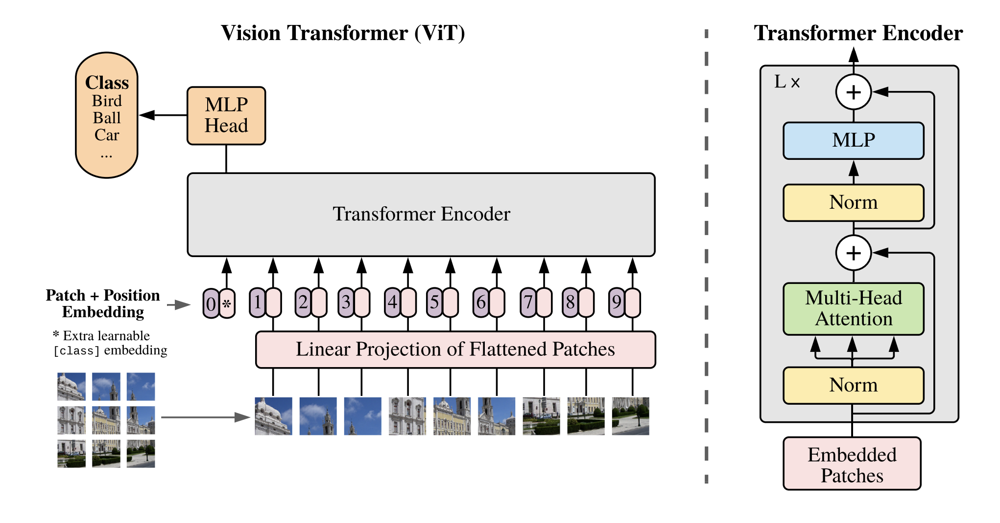
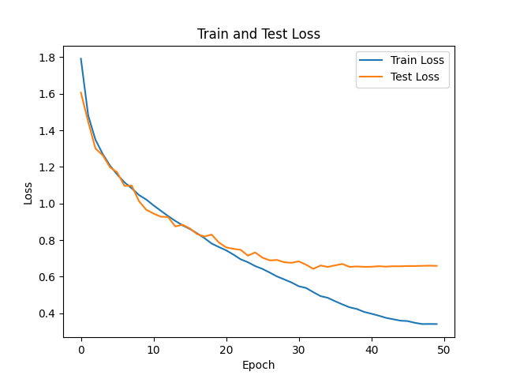
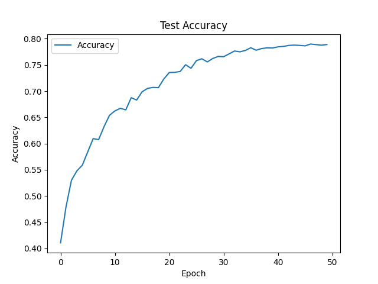
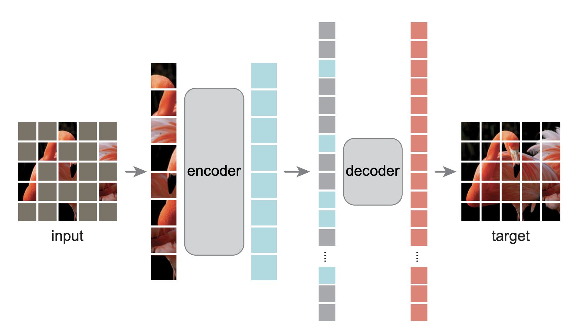
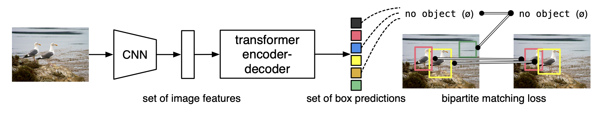
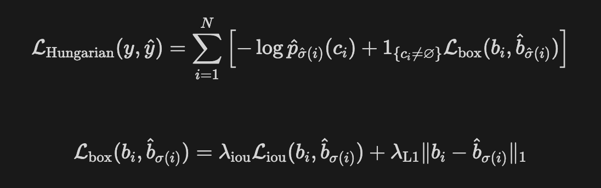

# Week 04 DS assignment(논문 구현)

논문리딩 스터디를 진행하면서 실제 코드로 구현하는 방식이 궁금했었다.

다만, 다음 과제에 치이며 코드를 직접 보는 일은 없었다.

과제를 논문 구현으로 낸다면 시너지가 나지 않을까?라는 생각이 들면서 본 과제를 기획했다.

~~한 가지 간과한게 있다면.. 3개 논문을 다 읽고 과제를 내야했다는 점..~~

## **An Image is Worth 16x16 Words: Transformers for Image Recognition at Scale**

```bash
git clone https://github.com/standor0415/ViT_assignment.git
cd ./ViT_assignment/Vit
pip install -r requirement.txt
```

Vision Transformer에서 image embedding 과정, forward에서 만들어 놓은 레이어를 어떻게 사용하는지를 확인할 수 있도록 만들었다.

Dataset은 CIFAR-10을 활용

TODO 밑에서부터 작성

```bash
python train.py
```

학습이 완료되면 .png 파일이 2개 생길것이다.




## Masked Autoencoders Are Scalable Vision Learners(MAE)

```bash
cd ../Mae
pip install -r requirement.txt
wget http://cs231n.stanford.edu/tiny-imagenet-200.zip
apt-get update
apt-get install zip
unzip tiny-imagenet-200.zip
```

Masked Autoencoders에서 이전 ViT에서 없었던 Decoder와 Masking 부분을 구현해보면 된다.

Dataset은 Tiny-Imagenet을 활용

TODO 밑에서부터 작성

```bash
python train.py
```

학습이 완료되면 .png 파일이 1개 생길것이다.


## **End-to-End Object Detection with Transformersd**
### Dataset preparation

COCO dataset을 사용했다.

용량이 크므로 root 밖에 다운 받는 것을 권장한다.

```bash
cd ~/../
mkdir -p path/to/coco
cd path/to/coco
wget http://images.cocodataset.org/zips/train2017.zip
wget http://images.cocodataset.org/zips/val2017.zip 
wget http://images.cocodataset.org/annotations/annotations_trainval2017.zip
unzip train2017.zip
unzip val2017.zip
unzip anannotations_trainval2017.zip
```

### Environment setting

```bash
cd ~/ViT_assignment/Detr
conda install cython scipy
pip install -U 'git+https://github.com/cocodataset/cocoapi.git#subdirectory=PythonAPI'
pip install -r requirements.txt
```


이번 과제는 Criterion 수식을 코드에서 어떻게 구현하는지 알아보는 것이다.



TODO를 채워주시고 해당 함수를 다른 사람에게 설명한다는 생각으로 주석을 단다.(TODO 코드가 매우 간단)

즉, SetCriterion class의 `loss_labels`, `loss_boxes` 함수 코드에 주석을 다는것

다음과 같이 코드를 실행시킨다.

```bash
python main.py --epochs 1 --coco_path /path/to/coco
```

코드를 성공적으로 실행되면 다음과 같이 eta, lr, class_error 등이 뜬다.

training 진행중인 터미널 창 캡쳐해서 training.png 파일과 [detr.py](http://detr.py) 파일 업로드(코드 돌아가는지 확인용) 

```bash
Epoch: [0]  [10490/59143]  eta: 1:58:49  lr: 0.000100  class_error: 100.00  loss: 27.1212 (30.5405)  loss_ce: 1.6510 (1.9659)  loss_bbox: 1.4159 (1.5160)  loss_giou: 1.5348 (1.5916)  loss_ce_0: 1.6919 (1.9926)  loss_bbox_0: 1.3585 (1.5603)  loss_giou_0: 1.5267 (1.6003)  loss_ce_1: 1.7223 (1.9889)  loss_bbox_1: 1.4176 (1.5295)  loss_giou_1: 1.5357 (1.5909)  loss_ce_2: 1.6963 (1.9698)  loss_bbox_2: 1.3552 (1.5112)  loss_giou_2: 1.5032 (1.5820)  loss_ce_3: 1.6056 (1.9668)  loss_bbox_3: 1.4752 (1.5202)  loss_giou_3: 1.5730 (1.5890)  loss_ce_4: 1.7427 (1.9723)  loss_bbox_4: 1.3228 (1.5082)  loss_giou_4: 1.5780 (1.5851)  loss_ce_unscaled: 1.6510 (1.9659)  class_error_unscaled: 100.0000 (99.9918)  loss_bbox_unscaled: 0.2832 (0.3032)  loss_giou_unscaled: 0.7674 (0.7958)  cardinality_error_unscaled: 4.0000 (6.6179)  loss_ce_0_unscaled: 1.6919 (1.9926)  loss_bbox_0_unscaled: 0.2717 (0.3121)  loss_giou_0_unscaled: 0.7634 (0.8002)  cardinality_error_0_unscaled: 4.0000 (6.6090)  loss_ce_1_unscaled: 1.7223 (1.9889)  loss_bbox_1_unscaled: 0.2835 (0.3059)  loss_giou_1_unscaled: 0.7678 (0.7954)  cardinality_error_1_unscaled: 4.0000 (6.6136)  loss_ce_2_unscaled: 1.6963 (1.9698)  loss_bbox_2_unscaled: 0.2710 (0.3022)  loss_giou_2_unscaled: 0.7516 (0.7910)  cardinality_error_2_unscaled: 4.0000 (6.6245)  loss_ce_3_unscaled: 1.6056 (1.9668)  loss_bbox_3_unscaled: 0.2950 (0.3040)  loss_giou_3_unscaled: 0.7865 (0.7945)  cardinality_error_3_unscaled: 4.0000 (6.6239)  loss_ce_4_unscaled: 1.7427 (1.9723)  loss_bbox_4_unscaled: 0.2646 (0.3016)  loss_giou_4_unscaled: 0.7890 (0.7926)  cardinality_error_4_unscaled: 4.0000 (6.6157)  time: 0.1455  data: 0.0058  max mem: 5581
```
(참고) Hungarian Algorithm이 궁금하시다면 model/matcher.py에 있는 HungarianMatcher class를 보면 된다.
## 제출파일

Week04 폴더에 ViT_acc.png, ViT_loss.png, result.png, training.png, `detr.py`

제출기한: ~10/28 23:59