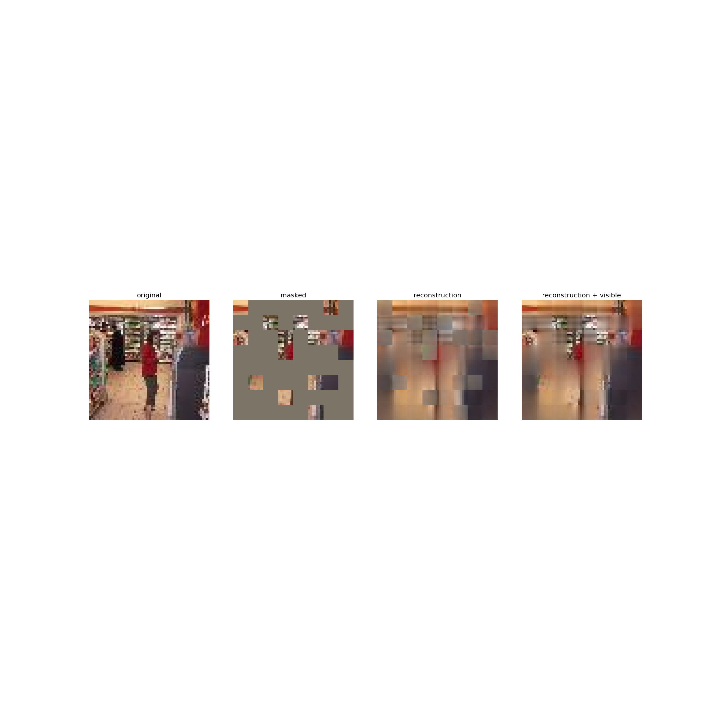

# Week 04 DS assignment(논문 구현)

논문리딩 스터디를 진행하면서 실제 코드로 구현하는 방식이 궁금했었다.

다만, 다음 과제에 치이며 코드를 직접 보는 일은 없었다.

과제를 논문 구현으로 낸다면 시너지가 나지 않을까?라는 생각이 들면서 본 과제를 기획했다.

~~한 가지 간과한게 있다면.. 3개 논문을 다 읽고 과제를 내야했다는 점..~~

## **An Image is Worth 16x16 Words: Transformers for Image Recognition at Scale**

```bash
git clone https://github.com/standor0415/ViT_assignment.git
cd ./ViT_assignment/Vit
pip install -r requirement.txt
```

Vision Transformer에서 image embedding 과정, forward에서 만들어 놓은 레이어를 어떻게 사용하는지를 확인할 수 있도록 만들었다.

TODO 밑에서부터 작성

```bash
python train.py
```

학습이 완료되면 .png 파일이 2개 생길것이다.


## Masked Autoencoders Are Scalable Vision Learners(MAE)

```bash
cd ../Mae
pip install -r requirement.txt
wget http://cs231n.stanford.edu/tiny-imagenet-200.zip
apt-get update
apt-get install zip
unzip tiny-imagenet-200.zip
```

Masked Autoencoders에서 이전 ViT에서 없었던 Decoder와 Masking 부분을 구현해보면 된다.

TODO 밑에서부터 작성

```bash
python train.py
```

학습이 완료되면 .png 파일이 1개 생길것이다.



## **End-to-End Object Detection with Transformersd**